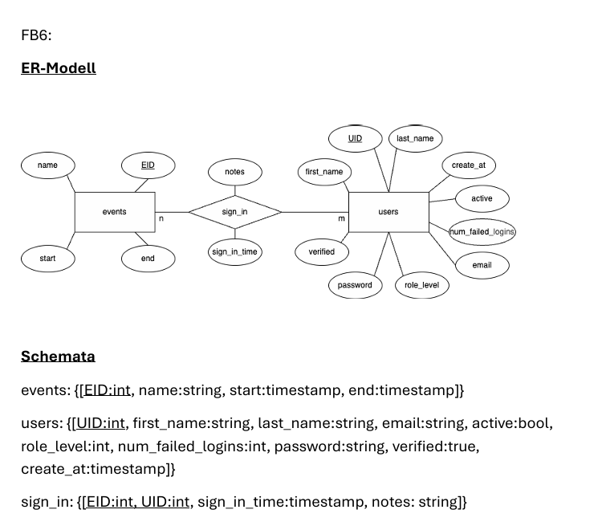

# Webdatenbanken

## Kurzbeschreibung

Ziel ist es, die Kommunikation zwischen unserer Gruppe (Gruppe‑FB4) und der REST‑API von Gruppe‑FB5 zu realisieren — Daten von API empfangen & senden und für Gruppe‑FB3 bereitstellen.





## Aufgabenstellung

- Datenempfang und -versand über eine REST‑API
- Authentifizierung/Autorisierung mittels JSON Web Tokens (JWT)
- Asynchrone Anfragen mit AJAX (jQuery)

## Architektur
# Überblick
```bash
wiwsall
├── public 📁
├── src 📁
├── vendor 📁
├── .htaccess
├── .htpasswd
└── index.html
```
# JavaScript
```bash
wiwsall
├── public
│   ├── css 📁
│   ├── img 📁
│   └── js 📁
│       ├──bootstrap 📁
│       ├── /*app.js
│       ├── /*timeEntry.js
│       ├── /*user.js
│       ├── swagger 📁
│       ├── .htaccess
│       ├── favicon.ico
│       ├── index.html
│       ├── index.php
│       ├── timeEntries.html
│       └── users.html
├── src 📁
├── vendor 📁
├── .htaccess
├── .htpasswd
└── index.html
```
# PHP und DB
```bash
wiwsall
├── public
├── src 📁
│   ├── Controllers 📁
│   │   ├── JWTHandler.php
│   │   ├── TimeEntryController.php
│   │   └── UserController.php
│   ├── Database 📁
│   │   └── /* database.sql
│   ├── Models 📁
│   │   ├── Database.php
│   │   ├── TimeEntry.php
│   │   ├── User.php
│   ├── Routes 📁
│   │    └── routes.php
│   └── Views 📁
├── vendor 📁
├── .htaccess
├── .htpasswd
└── index.html
```
## Verwendete / vorgeschlagene Technologien

- JavaScript
- REST (HTTP‑Methoden)
- JSON Web Token (JWT)
- jQuery (AJAX)
- Postman (API-Testing)

## Nützliche Links / Lernmaterial

- jQuery AJAX (Referenz): https://www.w3schools.com/jquery/jquery_ref_ajax.asp


- AJAX mit JavaScript (Übersicht): https://www.w3schools.com/js/js_ajax_http.asp


Zusätzlich: Lernstoff aus den Vorlesungsfolien "Theorie Session – Kapitel 4: Dynamische Webinhalte und AJAX" oder Ordner: "ajax_jquery_json_Beispiel".

- JSON Web Token (Artikel): https://www.geeksforgeeks.org/web-tech/json-web-token-jwt/
- RESTful HTTP Methods (Erklärung): https://restfulapi.net/http-methods/


## Datenbankpasswörter & Anleitung

- DB: 23i_dev_mydbox
- FTP: 23i_dev_myftpox
- Path: 23i_dev_mypathox


## Gruppenaufbau
- Michi (Produktowner)
- Jonathan (Agility Master)
- Tim & Andy (Programmierung haupt.)
- Harry, Niels, Lukas (Testing & Qualitätssicherung - Präsi?)
- Alle Mitglieder können gerne bei der Programmierung helfen 😊
## Aufbau REST-API

Rahmenbedingungen

- Eingabe und Ausgabe erfolgen ausschließlich in JSON.
- Token‑basierte Authentifizierung (JWT) für geschützte Endpunkte.

### Authentifizierung & Nutzer — Endpunkte (als Tabellen)

Login

| Feld | Wert |
|---|---|
| Titel | LOGIN |
| Endpunkt | POST /auth/login |
| Header | `{ "Content-Type": "application/json" }` |
| Body (JSON) | `{ "email": "", "password": "" }` |
| Beschreibung | Meldet Benutzer an und gibt JWT-Token zurück. user.js prüft Eingaben, ruft Request-Controller auf; Token wird im Controller sicher gespeichert (z.B. memory/localStorage) und bei Folge-Requests als Bearer gesetzt. UserController verifiziert Credentials, erzeugt JWT (JWTHandler) mit Ablaufzeit, antwortet JSON { token }. |
| Response Codes | `200 OK` – Erfolgreich angemeldet<br>`400 Bad Request` – Ungültige Eingabedaten<br>`401 Unauthorized` – Falsche Email oder Passwort oder verified=false<br>`500 Internal Server Error` – Serverfehler<br>`429 optional nach mehreren failed-logins.` |
| Antwort Body (JSON) | `{ server_communication:{"code": "$code", "response": "$responseName", "message": "$responseMessage"}, "token": "<jwt-token>", "users":{"active":""} }` |
| Hinweise | `POST /auth/failed-login` erhöht einen Failed‑Login‑Zähler: `{ "num_failed_logins": 1 }` |

Passwort vergessen

| Feld | Wert |
|---|---|
| Titel | PASSWORT VERGESSEN |
| Endpunkt | GET /auth/forgot (Anfrage)<br>PATCH /auth/forgot (Neues Passwort setzen) |
| Header | `{ "Content-Type": "application/json" }` |
| Body (JSON) GET | `{ "email": "" }` |
| (Email-Link) Body (JSON) PATCH | `{ "newPassword": "", "resetToken": "<jwt-token>" }` |
| Beschreibung | Ermöglicht Benutzern das Zurücksetzen des Passworts.Frontend: user.js sendet E-Mail (GET) bzw. neues Passwort (PATCH) via Request-Controller; validiert Passwortregeln clientseitig.Backend: UserController initiiert Reset-Flow (Token/Code per Mail), setzt neues Passwort auf PATCH, invalidiert alte Tokens. Sicherheit: Rate-Limit/Throttle, keine Details leaken (immer generische Antwort) |
| Response Codes | `200 OK` – Anfrage erfolgreich verarbeitet<br>`400 Bad Request` – Ungültige Eingabedaten<br>`404 Not Found` – Email nicht gefunden<br>`500 Internal Server Error` – Serverfehler |
| Antwort Body (JSON) | `{ server_communication:{"code": "$code", "response": "$responseName", "message": "$responseMessage"} }` |


Registrieren

| Feld | Wert |
|---|---|
| Titel | REGISTRIERUNG |
| Endpunkt | POST /auth/register |
| Header | `{ "Content-Type": "application/json" }` |
| Body (JSON) | `{ "email": "", "password": "", "first_name": "", "last_name": "", "timestamp": "" }` |
| Beschreibung | Registriert neue Nutzer, Nutzer müssen sich dennoch erst anmelden, um Token zu erhalten |
| Response Codes | `201 Created` – Erfolgreich erstellt<br>`400 Bad Request` – Passwort zu kurz/schwach oder formal ungültige Daten<br>`409 Conflict` – Email bereits vorhanden<br>`500 Internal Server Error` – Serverfehler |
| Antwort Body (JSON) | `{ server_communication:{"code": "$code", "response": "$responseName", "message": "$responseMessage"} }` |

All Events (admins & nutzer) (Dashboard)

| Feld | Wert |
|---|---|
| Titel | ALL EVENTS (DASHBOARD) |
| Endpunkt | GET /events/all/info |
| Header | `{ "Content-Type": "application/json", "Authorization": "Bearer <token>" }` |
| Body (JSON) | Kein Body erforderlich |
| Beschreibung | Liefert alle Events des eingeloggten Users (Token im Authorization Header) |
| Response Codes | `200 OK` – Events erfolgreich abgerufen<br>`401 Unauthorized` – Kein oder ungültiges Token<br>`500 Internal Server Error` – Serverfehler |
| Antwort Body (JSON) | `{ server_communication:{"code": "$code", "response": "$responseName", "message": "$responseMessage"}, "events": [{ "name": "", "notes": "", "EID": "", "start": "", "end": "" }] }` |

Single Events (admins) (Dashboard)

| Feld | Wert |
|---|---|
| Titel | SINGLE EVENTS - ADMIN (DASHBOARD) |
| Endpunkt | GET /events/single/info (Abrufen)<br>POST /events/single/erstellen (Aufsetzen)<br>PUT /events/single/bearbeiten (Bearbeiten)<br>DELETE /events/single/loeschen (Löschen) |
| Header | `{ "Content-Type": "application/json", "Authorization": "Bearer <token>" }` |
| Body (JSON) GET | Kein Body erforderlich |
| Body (JSON) POST/PUT | `{ "name": "", "EID": "", "start": "", "end": "" }` |
| Body (JSON) DELETE | `{ "EID": "" }` |
| Beschreibung | Verwaltet einzelne Events (Admin-Funktionen: Erstellen, Bearbeiten, Löschen, Abrufen) |
| Response Codes | `200 OK` – Erfolgreich abgerufen/bearbeitet<br>`201 Created` – Event erfolgreich erstellt<br>`400 Bad Request` – Ungültige Eingabedaten<br>`401 Unauthorized` – Kein oder ungültiges Token<br>`403 Forbidden` – Keine Admin-Berechtigung<br>`404 Not Found` – Event nicht gefunden<br>`500 Internal Server Error` – Serverfehler |
| Antwort Body (JSON) | `{ server_communication:{"code": "$code", "response": "$responseName", "message": "$responseMessage"}, "events": { "name": "", "EID": "", "start": "", "end": "", "sign_in": {"last_name":"","first_name":"","sign_in_time":"","sign_out_time":"", "notes":""} } }` |

Single Events (nutzer) (Dashboard)

| Feld | Wert |
|---|---|
| Titel | SINGLE EVENTS - NUTZER (DASHBOARD) |
| Endpunkt | GET /events/single/info (Abrufen)<br>POST /events/single/Teilnahme (Teilnehmen/Ausloggen) |
| Header | `{ "Content-Type": "application/json", "Authorization": "Bearer <token>" }` |
| Body (JSON) GET | Kein Body erforderlich |
| Body (JSON) POST (Teilnehmen) | `{ "EID": "", "sign_in_time": timestamp }` |
| Body (JSON) POST (Ausloggen) | `{ "EID": "", "sign_out_time": timestamp }` |
| Beschreibung | Ermöglicht Nutzern das Abrufen von Event Infos sowie Teilnahme oder vorzeitiges Ausloggen |
| Response Codes | `200 OK` – Erfolgreich abgerufen/bearbeitet<br>`400 Bad Request` – Ungültige Eingabedaten<br>`401 Unauthorized` – Kein oder ungültiges Token<br>`404 Not Found` – Event nicht gefunden<br>`500 Internal Server Error` – Serverfehler |
| Antwort Body (JSON) | `{ server_communication:{"code": "$code", "response": "$responseName", "message": "$responseMessage"}, "events": { "name": "", "EID": "", "start": "", "end": "", "sign_in_time": "" } }` |


Kontoansicht (Users)

| Feld | Wert |
|---|---|
| Titel | KONTOANSICHT (USERS) |
| Endpunkt | GET /users |
| Header | `{ "Content-Type": "application/json", "Authorization": "Bearer <token>" }` |
| Body (JSON) | Kein Body erforderlich |
| Beschreibung | Liefert Übersicht der Nutzerattribute des eingeloggten Benutzers |
| Response Codes | `200 OK` – Erfolgreich abgerufen<br>`401 Unauthorized` – Kein oder ungültiges Token<br>`404 Not Found` – Benutzer nicht gefunden<br>`500 Internal Server Error` – Serverfehler |
| Antwort Body (JSON) | `{ server_communication:{"code": "$code", "response": "$responseName", "message": "$responseMessage"}, "users": { "UID": "", "first_name": "", "last_name": "", "email": "", "active": "","verified": "", "num_failed_logins": "" } }` |


## Genaue Ziele (EPICS)
- Blueprints (Vorarbeit):
    - JWT → erstellen + Validierung 
    - Qualitätssicherrung: Funktionale Tests, (Funktioniert der Login/Registrieren/Logout,Passwort resetten), JSON-Struktur Annahme (JWT) Tests, Tests auf technische Verbindungsfehler und Logische Verbindungsfehler(pw nicht richtig etc (nach überreichung der JSON))
    
    - Login
    - Registrieren
    - Passwort vergessen
    - Events
- Implementierung
- Abstimmung mit FB3 & FB5
- Präsentation
