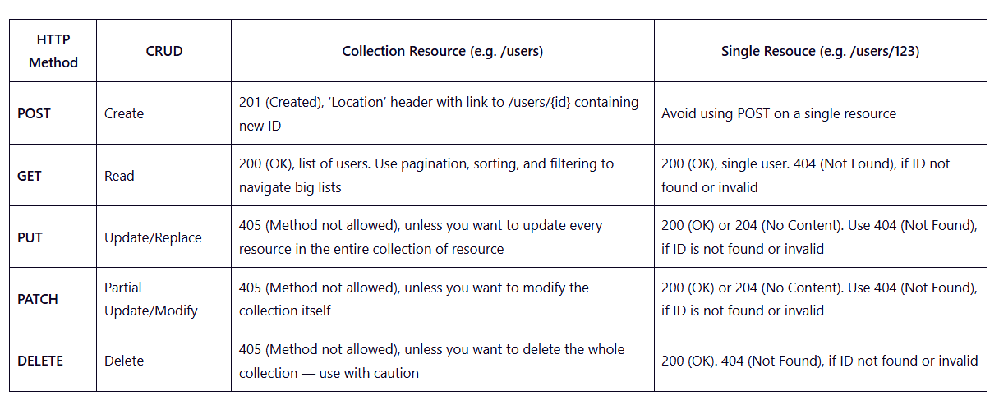
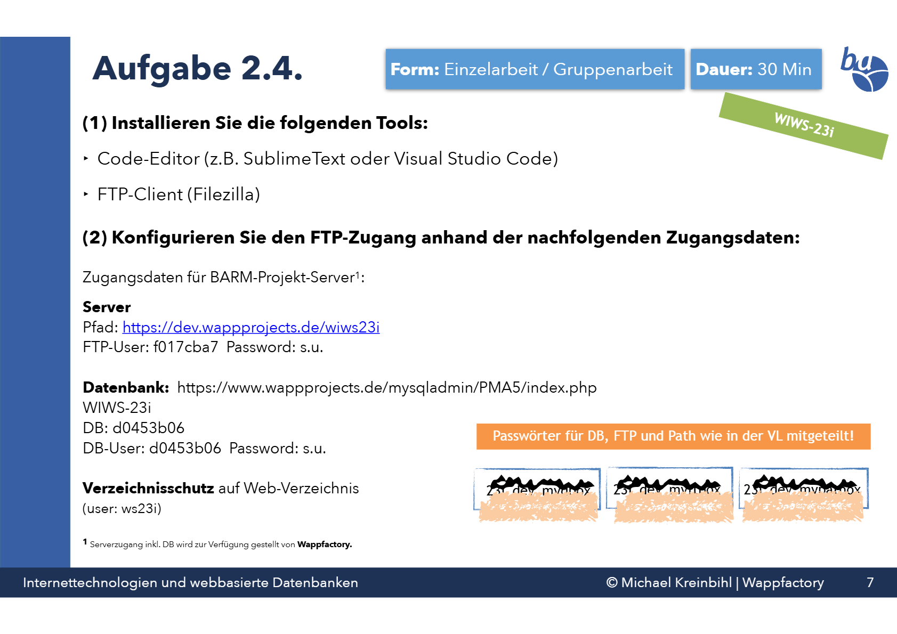
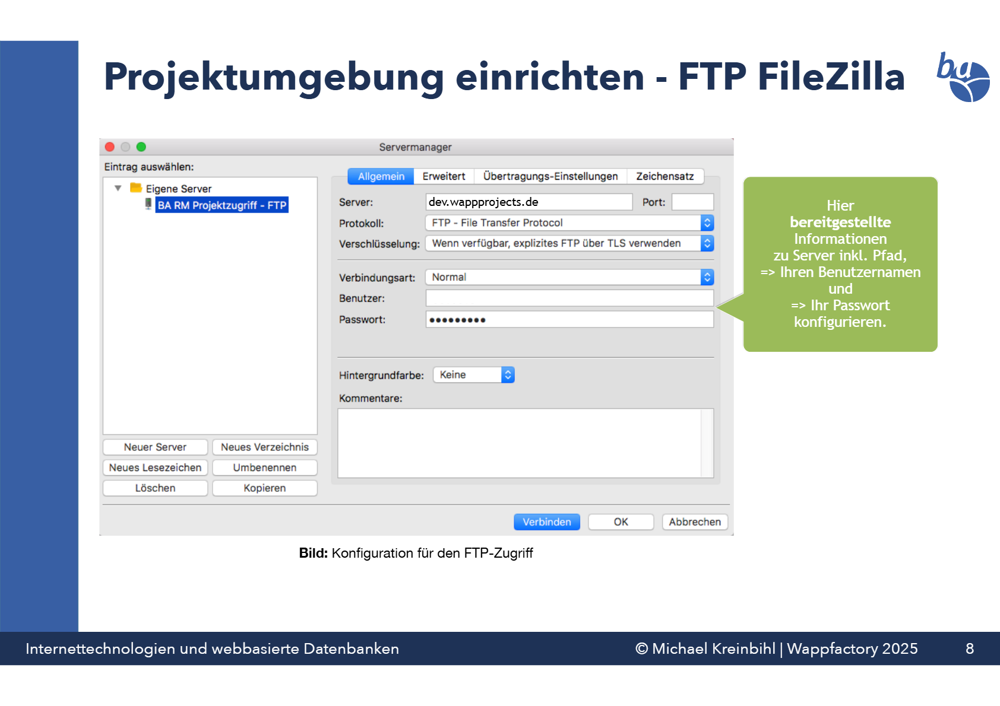

# Webdatenbanken

## Kurzbeschreibung

Ziel ist es, die Kommunikation zwischen unserer Gruppe (Gruppe‑FB4) und der REST‑API von Gruppe‑FB5 zu realisieren — Daten von API empfangen & senden und für Gruppe‑FB3 bereitstellen.

## Aufgabenstellung

- Datenempfang und -versand über eine REST‑API
- Authentifizierung/Autorisierung mittels JSON Web Tokens (JWT)
- Asynchrone Anfragen mit AJAX (jQuery)

## Verwendete / vorgeschlagene Technologien

- JavaScript
- REST (HTTP‑Methoden)
- JSON Web Token (JWT)
- jQuery (AJAX)
- Postman (API-Testing)

## Nützliche Links / Lernmaterial

- jQuery AJAX (Referenz): https://www.w3schools.com/jquery/jquery_ref_ajax.asp

- AJAX mit JavaScript (Übersicht): https://www.w3schools.com/js/js_ajax_http.asp

Zusätzlich: Lernstoff aus den Vorlesungsfolien "Theorie Session – Kapitel 4: Dynamische Webinhalte und AJAX" oder Ordner: "ajax_jquery_json_Beispiel".

- JSON Web Token (Artikel): https://www.geeksforgeeks.org/web-tech/json-web-token-jwt/
- RESTful HTTP Methods (Erklärung): https://restfulapi.net/http-methods/

## Datenbankpasswörter & Anleitung

- DB: 23i_dev_mydbox
- FTP: 23i_dev_myftpox
- Path: 23i_dev_mypathox

## Gruppenaufbau
- Michi (Produktowner)
- Jonathan (Agility Master)
- Tim & Andy (Programmierung haupt.)
- Harry, Niels, Lukas (Testing & Qualitätssicherung - Präsi?)
- Alle Mitglieder können gerne bei der Programmierung helfen 😊
## Aufbau REST-API

Rahmenbedingungen

- Eingabe und Ausgabe erfolgen ausschließlich in JSON.
- Token‑basierte Authentifizierung (JWT) für geschützte Endpunkte.

### Authentifizierung & Nutzer — Endpunkte (als Tabellen)

Login

| Feld | Wert |
|---|---|
| Methode | POST |
| Pfad | `/auth/login` |
| Request (Body) | `{ "email": "string", "password": "string" }` |
| Erfolgreiche Antwort | `{ "token": "<jwt-token>" }` |
| Hinweise | `POST /auth/failed-login` erhöht einen Failed‑Login‑Zähler: `{ "failed": 1 }` |

Passwort vergessen

| Feld | Wert |
|---|---|
| Methode | GET && PATCH |
| Request (Anfrage) | `GET /auth/forgot` — Body: `{ "email": "user@example.com" }` |
| Setzen neues Passwort | `PATCH /auth/forgot` — Body: `{ "newPassword": "neuesPasswort" }` |

Registrieren

| Feld | Wert |
|---|---|
| Methode | POST |
| Pfad | `/auth/register` |
| Request (Body) | `{ "email", "password", "firstName", "lastName", "timestamp" }` |
| Beispiel | `{ "email": "user@example.com", "password": "passwort", "firstName": "Vorname", "lastName": "Nachname", "timestamp": "2026-02-03T12:00:00Z" }` |

Events (Dashboard)

| Feld | Wert |
|---|---|
| Methode | GET |
| Pfad | `/events` |
| Beschreibung | Liefert Events des eingeloggten Users (Token im Authorization Header) |
| Antwort (Schema) | `[{ "name","notes","eid","start","end","signIn" }]` |

Token‑Validierung

| Feld | Wert |
|---|---|
| Methode | GET |
| Pfad | `/auth/validate` (oder Middleware) |
| Header | `Authorization: Bearer <token>` |
| Antwort | `200 OK` (gültig) / `401 Unauthorized` (ungültig) |

Kontoansicht (Users)

| Feld | Wert |
|---|---|
| Methode | GET |
| Pfad | `/users` |
| Beschreibung | Übersicht der Nutzerattribute (sichtbar) |
| Antwort (Beispiel) | `{ "uid","firstName","lastName","email","active","runFailed" }` |

## Genaue Ziele (EPICS)
- Blueprints (Vorarbeit):
    - JWT → erstellen + Validierung
    - Login
    - Registrieren
    - Passwort vergessen
    - Events
- Implementierung
- Abstimmung mit FB3 & FB5
- Präsentation
